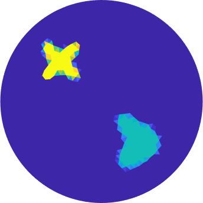
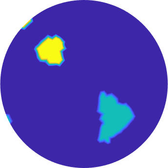

# Bayesian inclusion detection for quantitative photoacoustic tomography

<p style="text-align:center;">
                            
</p>

Ground true parameter on fine mesh (left). Sample from a posterior distribution for inclusion detection based on a star-shaped parametrization (middle) and a level set parametrization (right) both on a coarse mesh.
$`10^3`$ samples were computed. This took around $`\sim`$ 1 minute.

```diff
@@ Run files from the root folder. @@
```

## driver.m
The file `driver.m` demonstrates the main capabilities of this collections of scripts. It:
1. Constructs a triangular finite element mesh for the unit disc based on element size `hmax`. We recommend `hmax >= 0.03` for a smooth initial experience.
2. Samples from prior distributions based on Matern Gaussian fields and the star-shaped set and level set parametrizations.
3. Computes data for a specific ground true parameter on a fine mesh, see <b>Data</b> below.
4. Approximates approximation error arising from fine and coarse mesh differences.
5. Samples a posterior distribution based on the prior distributions and a likelihood arising from white noise observations of $`\langle H, \phi_k \rangle_{L^2(\mathcal{O}))} + \varepsilon \xi_k`$, where $`H`$ is the true observation, $`\phi_k`$ are Dirichlet Laplacian eigenfunctions, $`\varepsilon>0`$ is a noise level and $`\xi_k\sim N(0,1)`$ i.i.d. The posterior is sampled using a Markov Chain Monte Carlo (MCMC) method, the preconditioned Crank-Nicolson (pCN) scheme.


## Parametrizations
In this folder the main functions are:
1. `prior_init.m`
2. `prior_init2d.m`
   
Both return a structure containing Matern KL (Karhunen-Loeve) eigenfunctions $`\{e_k\}_{k\in \mathbb{Z}^m}`$ and eigenvalues $`\{\lambda_k\}_{k\in \mathbb{Z}^m}`$ truncated corresponding to a user specified max frequency `max_freq`. These are basis functions on the 1D and 2D toruses, respectively.
Given an i.i.d Gaussian vector of same length as the number of eigenfunctions, `priorsample.m` computes the KL expansion
$$\theta = \sum_{k} \xi_k \sqrt{\lambda_k} e_k.$$

The two other main functions of this folder are the functions pertaining to the parametrizations:

3. `push_forward_levelset2D_smooth.m`
4. `push_forward_star2D_interp.m`

The first uses a continuous approximation of the heaviside function to filter the two-dimensional Gaussian field $`\theta`$ to a piecewise constant parameter. This we call the smoothened level set parametrization.
The second uses as input a one-dimensional periodic Gaussian process and maps it to a star-shaped set. This parametrization uses the routine `inpoly2.m`, see <a href="https://www.mathworks.com/matlabcentral/fileexchange/10391-inpoly-a-fast-points-in-polygon-test">inpoly</a>.

## Finite element routines
The `FEM` folder builds on finite element routines in first order Lagrange basis and discontinuous Galerkin basis. Many of these routines build on code by Niko Hänninen, Tanja Tarvainen and Ville Kolehmainen (University of Eastern Finland).
The goal of the code is to efficiently compute $`H = \gamma u`$ given $`(D,\gamma)`$, where $`u`$ solves
$$\nabla \cdot (D \nabla u) + \gamma u = 0 \text{ in } \mathcal{O}, \quad u = f \text{ on } \partial \mathcal{O}.$$
Here we consider the unit disk $\mathcal{O}$. The Dirichlet condition $`f`$ is specified in `make_data.m` as a function $`w_f`$ in $`\mathcal{O}`$ such that $`w_f|_{\mathcal{O}}=f`$. 

## Data
Data is synthetised as
$$\langle H, \phi_k \rangle_{L^2(D)} + \varepsilon \xi_k,$$
where $`H`$ is the observation for the ground truth, $`\phi_k`$ are Dirichlet Laplacian eigenfunctions, $`\varepsilon>0`$ is a noise level and $`\xi_k\sim N(0,1)`$ i.i.d. Here, we have fixed a max frequency of Dirichlet Laplacian eigenfunctions to observe, namely `N=13`, which means the total number of Dirichlet eigenfunctions are set to `trunc = N*(2*N+1)`. The Dirichlet Laplacian eigenfunctions are computed on the fine data mesh, and later interpolated to the coarse mesh so they can be used for forward computations. These are computed using the Matlab routine `sptarn`.
This is implemented in the function `make_data.m`, which returns a structure `datapar` containing the noisy datavector of length `trunc`, as well as other useful parameters.

## MCMC
Main function is `pCNsampler.m`. This samples from the posterior distribution arising as the normalized product of the likelihood from the above observations and the push-forward priors. `pCNsampler.m` only requires one evaluation of the likelihood function each iteration, see <a href="https://en.wikipedia.org/wiki/Preconditioned_Crank–Nicolson_algorithm">pCN wiki</a>. The stepsize is user specified.

## Driverscripts
```diff
@@ Venture into this folder at your own responsibility. @@
```

### Main routines
There are two main functions in this folder
1. `levelPCN.m`
2. `starDGPCN.m`

The first file is a function that computes samples from the posterior arising from the level set parametrization. It automatically loads a saved `datapar` struct in a certain format. This is also the case of the second file, which computes samples from the posterior arising from the star-shaped set parametrization.
These functions are used for batch job scripts for submission to computing clusters, see also `maker.m`. We have not included any presaved `datapar` structs, since they are above the size limit. These will then return erros unless suitable `datapar` structs are computed and saved beforehand.  

## Figuremaking
```diff
@@ Venture into this folder at your own responsibility. @@
```
The .m scripts in this folder loads structs including samples that are not included for size reasons.
Our figure making scripts build on export_fig, see <a href="https://www.mathworks.com/matlabcentral/fileexchange/23629-export_fig">export_fig</a> and uses `tight_subplot`, see <a href="https://www.mathworks.com/matlabcentral/fileexchange/27991-tight_subplot-nh-nw-gap-marg_h-marg_w">tight_subplot</a>

## License
`inclusion-qPAT` is licensed under GNU General Public License v3.0.
