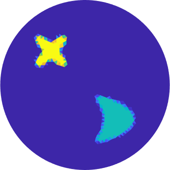

# Bayesian inclusion detection for quantitative photoacoustic tomography

                            

Ground true parameter (left). Sample from a posterior distribution for inclusion detection based on a star-shaped parametrization (middle) and a level set parametrization (right)

<b> should run everything from root folder</b>

## driver.m file

## Parametrizations
Main functions are:
`prior_init.m`
`prior_init2d.m`

returns a structure containing KL (Karhunen-Loeve) eigenfunctions $`\{e_k\}_{k\in \mathbb{Z}^m}`$ and eigenvalues $`\{\lambda_k\}_{k\in \mathbb{Z}^m}`$ truncated corresponding to a user specified max frequency `max_freq` for the Matern covariance.
Given an i.i.d Gaussian vector of same length as the number of eigenfunctions, priorsample.m computes the KL expansion
$$\theta = \sum_{k} \xi_k \sqrt{\lambda_k} e_k.$$

Parametrizations:
`push_forward_levelset2D_smooth.m`
`push_forward_star2D_interp.m`

the first uses continuous approximation of the heaviside function to filter $`\theta`$ .
the second uses `inpoly2.m`

## Finite element scripts
Builds on finite element routines in first order Lagrange basis and discontinuous Galerkin basis. Many of these routines build on code by Niko Hänninen, Tanja Tarvainen and Ville Kolehmainen (University of Eastern Finland).
Goal of the is to compute $`H = \gamma u`$ given $`(D,\gamma)`$, where $`u`$ solves
$$\nabla \cdot (D \nabla u) + \gamma u = 0 \text{ in } \mathcal{O}, \quad u = f \text{ on } \partial \mathcal{O}.$$
Here we consider the unit disk $\mathcal{O}$. The Dirichlet condition $`f`$ is specified in `make_data.m` as a function $`w_f`$ in $`\mathcal{O}`$ such that $`w_f|_{\mathcal{O}}=f`$. 

## Data
`N=13` and number of Dirichlet eigenfunctions are set to `trunc = N*(2*N+1)`.

## MCMC
Main function is `pCNsampler.m`. This 

## Driverscripts folder
### Functions
levelPCN
starDGPCN

driver scripts are scripts are scripts that submit batch jobs at DTUs distributed computing service. these will return erros unless on DTU gbar. Outputs and errors are served in the folder 'Output' and 'Error', respectively.

## Figuremaking
Builds on export_fig [link]
Uses tight_subplot
